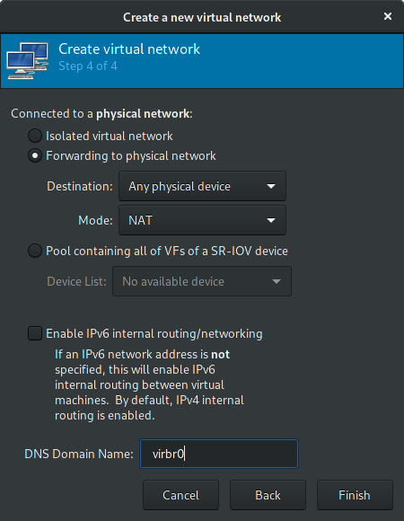
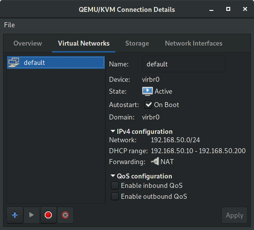
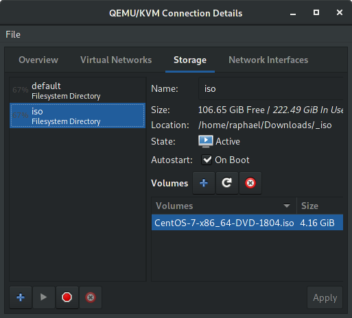
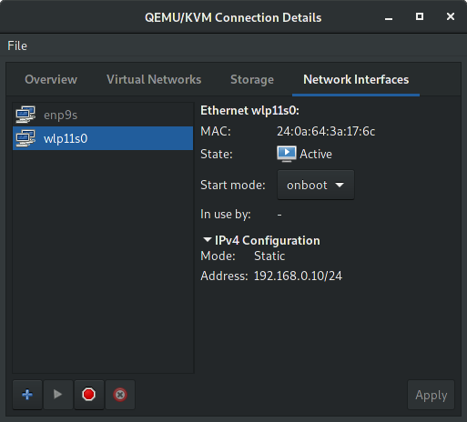
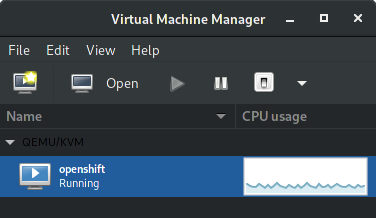
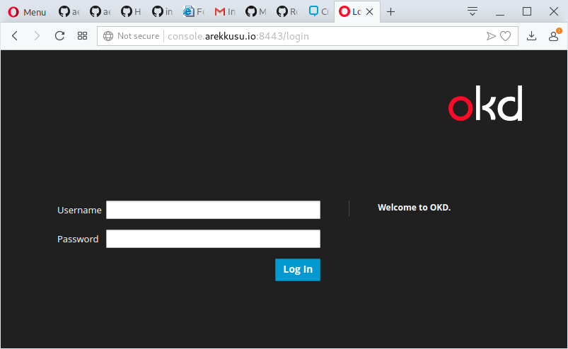
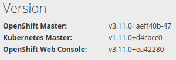
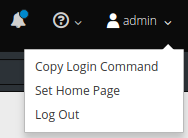
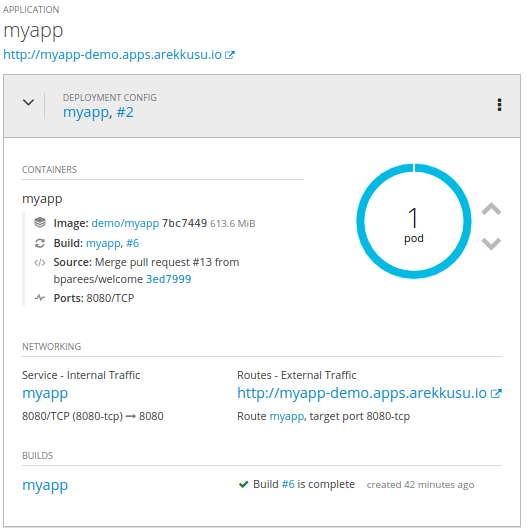

# ocp-arekkusu.io
A full detailed guide to install `Openshift (OKD)` into a single or more VMs using libvirt (openshift-ansible playbook)

This guide is mostly based on:

- [dnsmasq appendix](https://github.com/openshift/training/blob/master/deprecated/beta-4-setup.md#appendix---dnsmasq-setup) from the [openshift-training](https://github.com/openshift/training) repo. 
- [openshift-ansible playbook](https://github.com/openshift/openshift-ansible).
- [gshipley installcentos scripts](https://github.com/gshipley/installcentos).
- [libvirt howto](https://github.com/openshift/installer/blob/master/docs/dev/libvirt-howto.md).
- [jlebon/dnsmasq gist](https://gist.github.com/jlebon/0cfcd3dcc7ac7de18a69).
- [getting started with wildfly](https://blog.openshift.com/getting-started-with-wildfly)

However, I updated it for my needs and included fixes for the many gotchas I found along the way.

This is useful for folks who want to set up a DNS service as part of the cluster itself, either because they cannot
easily change their DNS setup outside of the cluster, or just because they want to keep the cluster setup self-contained.

**TL;DR**
- You can't modify external DNS and/or your router sux :angry:
- You can't modify your router or anything but your libvirt host :cry:
- You want to expose your cloud inside a LAN (WiFi) not internet :heavy_check_mark:
- You don't want to use minishift project or understand more about OKD installation process:heavy_check_mark:
- You have a 'bulky' laptop or Desktop PC for use as dedicated openshit cluster and want to work from another computer with development tools only :heavy_check_mark:

This is meant to be done *before* you run the `openshift-ansible` playbook, but it can be adjusted if you have already installed openshift using `openshift-ansible` playbook.
If you already have docker running, you will have to restart it after doing these steps.

Eventually, I hope to convert this to an ansible playbook. Thanks for your understanding.

---

```
~~~~~~~~~~~~~~~~~~~~~~~~~~~~~~~~~~~~~~~~~~~~~~~~~~~~~~
| Internet (ISP > Modem > Firewall > Wireless Router |
~~~~~~~~~~~~~~~~~~~~~~~~~~~~~~~~~~~~~~~~~~~~~~~~~~~~~~
  \
  |
  +------------------------+
  | M1:Fedora 29 works.    | bare-metal (alienware 18)
  | KVM/libvirt server     | 
  +------------------------+
  | wlp11s0: 192.168.0.10  | static-ip address (wireless interface)
  +------------------------+---------------------------+
  | virbr0: 192.168.50.1   | NAT (libvirt)             |
  |                        |          +--------------+ |
  |                        |          | VM1/CentOS 7 | | eth0: 192.168.50.10 (openshift)
  |                        |          +--------------+ | console.arekkusu.io:8443
  |                        |          ...              | 
  +------------------------+---------------------------- 
  \\                                                     
  ||                                               
  // WiFi LAN                                      
  || Subnet Mask....: 255.255.255.0                
  \\ Default Gateway: 192.168.0.1                       
  ||                                               
  //                                               
  +------------------------+                       
  | M2:Fedora 28 works.    | bare-metal (laptop)
  | Developer Workstation  | 
  +------------------------+
  | wlp4s0: 192.168.0.17   | dynamic-ip address (wireless interface)
  +------------------------+ (development tools only)

  
```

## 1. Setup the host machine (bare-metal)

### 1.1 Choose your host machine

For my current scenario, I'll be using my dear old Alienware 18 :rocket:<br>
This machine is currently using the following hardware:
- Samsung EVO 850 SSD 500 GB
- 32 GB RAM Kingston HyperX Impact DDR3 SO-DIMM 1600 MHz
- Intel(R) Core(TM) i7-4800MQ CPU @ 2.70GHz

### 1.2 Choose your linux distro

For the bare-metal 'bulky' laptop I have choosen to use Fedora 29.<br>You can install a server centered OS like CentOS or Red Hat Enterprise Linux (requires active subscription).<br>
After installation, update your yum packages:

```
$ sudo yum -y update
$ sudo shutdown -r now
```

### 1.3 Install libvirt, git and docker

After the OS installation steps, execute the following in the terminal:

```
$ sudo dnf install -y qemu-kvm libvirt virt-manager virt-install bridge-utils net-tools nmap git docker
$ sudo systemctl start libvirtd.service 
$ sudo systemctl enable libvirtd.service

$ sudo gpasswd -a "${USER}" libvirt
$ sudo shutdown -r now
```

### 1.4 Configure host network

For this lab I have configure static-ip address for the server running libvirt.

Navigate through `/etc/sysconfig/network-scripts`<br>
Edit your wireless interface. It will be something like `ifcg-{SSID}`

To keep a static-ip address, you'll need to set this configuration like this:

`$ sudo vim /etc/sysconfig/network-scripts/ifcfg-<SSID>`

```
HWADDR=XX:xx:XX:xx:XX:xx
DEVICE=wlp11s0
ESSID=XXxxXXxxXX
MODE=Managed
KEY_MGMT=WPA-PSK
MAC_ADDRESS_RANDOMIZATION=default
TYPE=Wireless
PROXY_METHOD=none
BROWSER_ONLY=no
BOOTPROTO=static
DEFROUTE=yes
IPV4_FAILURE_FATAL=no
IPV6INIT=no
IPV6_AUTOCONF=yes
IPV6_DEFROUTE=yes
IPV6_FAILURE_FATAL=no
IPV6_ADDR_GEN_MODE=stable-privacy
NAME=NIGHTWING
UUID=9x99x9x-99x9-9x99x-xxxx-99xx99x9x9xxx9x9
ONBOOT=yes
IPADDR=192.168.0.10
NETMASK=255.255.255.0
PREFIX=24
GATEWAY=192.168.0.1
DNS1=192.168.0.1
DNS2=999.999.999.999
```

Then
`$ sudo systemctl restart NetWorkManager`<br>
If everything was setup correctly, you'll get connected with a static-ip address.

### 1.5 Configure host IPv4 forwarding

`libvirt` creates a bridged connection to the host machine, but in order for the network bridge to work IP forwarding needs to be enabled. 
To enable guest request forwarding you need to enable the `net.ipv4.ip_forward=1`.<br>Execute the following:

```
echo "net.ipv4.ip_forward = 1" | sudo tee /etc/sysctl.d/99-ipforward.conf
sudo sysctl -p /etc/sysctl.d/99-ipforward.conf
```
## 2. Setup libvirt guest (VM)

### 2.1 Setup libvirt using virt-manager

Open `virt-manager` application, then check if you're currently have an virtual-network configured.<br>
If you don't, create a new one following the image below:





To keep this virtual-network active every boot, then execute:<br>
`$ sudo virsh net-autostart default`

Then, install the guest ISO image (I'll be using [CentOS-7.5.1804](http://isoredirect.centos.org/centos/7/isos/x86_64/CentOS-7-x86_64-DVD-1804.iso)):


And finally check if your wireless interface is currently active with start mode set to onboot:


### 2.2 Deploy the kickstart.cfg into apache to create an automated installation

Inside you host, you may want to install `httpd` server to bypass the `guest` GUI configuration. :sunglasses:<br>
To do so, you'll need to host the kickstart file to be accessible from `virt-install` command.

```
$ sudo yum -y install httpd

# if you're using firewalld:
$ sudo firewall-cmd --permanent --add-port=80/tcp
$ sudo firewall-cmd --permanent --add-port=443/tcp
$ sudo firewall-cmd --reload

$ sudo systemctl start httpd
$ sudo systemctl enable httpd
$ sudo systemctl status httpd
```

Then, create the following directory:
`$ sudo mkdir /var/www/html/ks-cfg`<br>
And put the `server-ks-openshift.cfg` into that folder, and apply permissions:
```
$ git clone https://github.com/aelkz/ocp-arekkusu.io.git
$ cd ocp-arekkusu.io
$ sudo mv server-ks-openshift.cfg /var/www/html/ks-cfg/
$ sudo chmod 777 /var/www/html/ks-cfg/server-ks-openshift.cfg
```

After this, you should be able to grab the kickstart from the browser.<br>
Try navigating to the address `http://<IP>/ks-cfg/server-ks-openshift.cfg`<br>
Example: `http://192.168.0.10/ks-cfg/server-ks-openshift.cfg`

You are good to keep reading the guide for the next steps.

### 2.3 Create the openshift guest VM (virt-install)

With your kickstart configured and deployed into `httpd`, you can use it to create an automated installation using `virt-install` command.
<br>
Observe the following parameters bellow and change them accordingly to your currently desired environment.

```
virt-install -n "openshift" --ram 26000 --vcpus 6 --metadata description="openshift cluster" \
--location "/home/raphael/Downloads/_iso/CentOS-7-x86_64-DVD-1804.iso" --os-type=linux \
--os-variant=rhel7 --boot cdrom,hd,menu=on --disk path=/var/lib/libvirt/images/openshift.qcow2,size=200,sparse=false,cache=none \
--input keyboard --extra-args="ks=http://192.168.0.10/ks-cfg/server-ks-openshift.cfg ip=dhcp console=tty0 console=ttyS0,115200n8 serial" \
--network network:default --nographics
```

Your guest will start to install :boom: *automagically* :boom: and after you will be prompted for root access in the console.

Tip:
The `server-ks-openshift.cfg` file have the root password defined as `admin12345`

You should be able to see the guest running like the following image:



### 2.4 Check guest network configuration

In order to keep everything setup for the next steps, certify that network settings are well defined.<br>
Like the `host`, the `guest` must have an static address. Try navigating to `/etc/sysconfig/network-scripts` and check the `ifcfg-eth0` file.

The configuration must look like the following:
```
IPV6INIT="no"
DHCP_HOSTNAME="localhost.localdomain"
DNS2="8.8.4.4"
DNS1="8.8.8.8"
BOOTPROTO="static"
GATEWAY=192.168.50.1
DEVICE="eth0"
NETMASK=255.255.255.0
IPADDR=192.168.50.10
ONBOOT="yes"
UUID=9x99x9x-99x9-9x99x-xxxx-99xx99x9x9xxx9x9
PEERDNS=no
```

### 2.5 Update and install extra tools

Access guest VM through ssh protocol:<br>
`$ ssh root@192.168.50.10`

Update `yum` packages and install additional tools:
```
$ sudo yum -y update
$ sudo yum install git docker net-tools nmap
```

Restart `guest`:
`$ sudo shutdown -r now`

## 3. Install Openshift from openshift-ansible playbook into recently created libvirt guest (VM)

### 3.1 Execute the openshift-ansible playbook

Access guest through ssh protocol again:<br>
`$ ssh root@192.168.50.10`

Execute the *openshift-ansible playbook* from [gshipley installcentos scripts](https://github.com/gshipley/installcentos) installation script: 
```
git clone https://github.com/gshipley/installcentos.git

export DOMAIN=arekkusu.io
export USERNAME=admin
export PASSWORD=admin

cd installcentos
./install-openshift.sh
```

PS. Set your domain name and username/password accordingly to your needs.<br>
You may also change the `inventory.ini` parameters, in order to have a larger infrastructure. See more details [here](https://github.com/openshift/openshift-ansible)

### 3.2 Test openshift after installation

After the ansible-playbook installation, you should see the following output:
```
******
* Your console is https://console.arekkusu.io:8443
* Your username is admin
* Your password is admin
* 
* Login using:
*
$ oc login -u admin -p admin https://console.arekkusu.io:8443/
******
```

Test your installation accessing through web browser:


Check your current version, accessing the following path:
`https://console.arekkusu.io:8443/console/about`



Great! Let's go for the final steps. :sparkling_heart:

## 4. Prepare your DNS OKD with dnsmasq

### 4.1 Install dnsmasq

Choose and `ssh` into the node on which you want to install dnsmasq (mine is `guest` VM at `192.168.50.10`). This node will be the one that all the other nodes
will contact for DNS resolution.  *Do not* install it on any of the master nodes, since it will conflict with the Kubernetes DNS service.

PS. For my current scenario, I'll be using the only node that was created - i.e. the guest VM at `192.168.50.10`

`$ sudo yum install -y dnsmasq`

### 4.2 Configure dnsmasq

At this point, you'll probably have in the guest the following files:

```
$ cat /etc/dnsmasq.d/origin-dns.conf

no-resolv
domain-needed
no-negcache
max-cache-ttl=1
enable-dbus
dns-forward-max=10000
cache-size=10000
bind-dynamic
min-port=1024
except-interface=lo
# End of config
```

and

```
$ cat /etc/dnsmasq.d/origin-upstream-dns.conf

server=8.8.8.8
server=8.8.4.4
```

Append the following lines into the `origin-dns.conf`:

```
local=/arekkusu.io/
address=/.apps.arekkusu.io/192.168.50.10
```

This configuration will expose the services to the LAN and will make applications visible inside another PODs.

### 4.3 Configure hosts file

Add in the `/etc/hosts` file all the public IPs of the nodes and their hostnames, e.g.

```
192.168.122.26 ose3-master.example.com ose3-master
192.168.122.90 ose3-node1.example.com ose3-node1
192.168.122.152 ose3-node2.example.com ose3-node2
```

For my current scenario, I'll end with the following content:

```
127.0.0.1   localhost localhost.localdomain localhost4 localhost4.localdomain4 
::1         localhost localhost.localdomain localhost6 localhost6.localdomain6
192.168.50.10  localhost.localdomain console arekkusu.io console.arekkusu.io 
```

### 4.4 Configure resolv.conf file (main cluster)

Copy the original `/etc/resolv.conf` to `/etc/resolv.conf.upstream`
and in `/etc/dnsmasq.conf`, set `resolv-file` parameter to `/etc/resolv.conf.upstream`. e.g.

```
$ sudo vi /etc/dnsmasq.conf
.
.
.
# Change this line if you want dns to get its upstream servers from
# somewhere other that /etc/resolv.conf
resolv-file=/etc/resolv.conf.upstream
```

### 4.5 Configure resolv.conf file (other nodes from cluster)

On *all the nodes*, make sure that `/etc/resolv.conf` has the IP of the node running dnsmasq only. **Important:** on the node running
dnsmasq, do not use 127.0.0.1, use the actual cluster IP, just like the other nodes. This is because docker by default
[ignores](http://docs.docker.com/engine/userguide/networking/default_network/configure-dns/)
local addresses when copying `/etc/resolv.conf` into containers. Here's a sample
`/etc/resolv.conf`:

    ```
    search example.com
    # change this IP to the IP of the node running dnsmasq
    nameserver 192.168.50.10
    ```

PS. Only execute this step if you have more than one node running in the cluster topology.

### 4.6 Configure ifcfg-eth0 file (all nodes)

Make sure that in `/etc/sysconfig/network-scripts/ifcfg-eth0`, the variable `PEERDNS` is set to `no` so that `/etc/resolv.conf` doesn't get
overwritten on each reboot. Reboot the machines and check that `/etc/resolv.conf` hasn't been overwritten.

It will be like the following:

```
# Generated by parse-kickstart
IPV6INIT="no"
DHCP_HOSTNAME="localhost.localdomain"
DNS2="8.8.4.4"
DNS1="8.8.8.8"
BOOTPROTO="static"
GATEWAY=192.168.50.1
DEVICE="eth0"
NETMASK=255.255.255.0
IPADDR=192.168.50.10
ONBOOT="yes"
UUID=9x99x9x-99x9-9x99x-xxxx-99xx99x9x9xxx9x9
PEERDNS=no
```

### 4.7 Open DNS port and enable dnsmasq (main cluster)

Finally, make sure port 53/udp is open on the dnsmasq node. We have to use iptables rules for this, even if you have `firewalld` installed.
Otherwise, the `openshift-ansible` playbook will disable and mask it and we will lose those rules. If you do have `firewalld`, let's mask it and
replace it with `iptables-services`:

    ```
    # yum -y install iptables-services; systemctl disable firewalld; systemctl mask firewalld; service iptables restart; service iptables save
    ```

### 4.8 Install the DNS iptables rules (main cluster)

First, create a backup of your existing iptables rules:
```
# cp /etc/sysconfig/iptables-config /etc/sysconfig/iptables-config.original.backup
# cp /etc/sysconfig/iptables /etc/sysconfig/iptables.original.backup
```

Add rules for dnsmasq service:
```
# iptables -I INPUT 1 -p TCP --dport 53 -j ACCEPT
# iptables -I INPUT 1 -p UDP --dport 53 -j ACCEPT
```

The following rules are necessary to enable openshift applications be accessible from LAN, as the `guest` is **NAT**ed:
```
# iptables -t nat -I PREROUTING -p tcp -d 192.168.0.10 --dport 8443 -j DNAT --to-destination 192.168.50.10:8443
# iptables -t nat -I PREROUTING -p tcp -d 192.168.0.10 --dport 8080 -j DNAT --to-destination 192.168.50.10:8080
# iptables -t nat -I PREROUTING -p tcp -d 192.168.0.10 --dport 80 -j DNAT --to-destination 192.168.50.10:80
# iptables -t nat -I PREROUTING -p tcp -d 192.168.0.10 --dport 443 -j DNAT --to-destination 192.168.50.10:443
# iptables -I FORWARD -m state -d 192.168.50.10/24 --state NEW,RELATED,ESTABLISHED -j ACCEPT
```

### 4.9 Install libvirt qemu hook script to make sure that the rules are still there upon reboot.

Usually you'll just need to save the previously created iptables rules into `/etc/syconfig/iptables`. But libvirtd process don't works that way. You need to apply the iptables rules upon `guest` start.

So, saving everything to persist using the following method **will not work**:
```
# iptables-save > /etc/sysconfig/iptables
# systemctl restart iptables
```

You'll need to create a custom script that will **hook the libvirt starting process**.
To do so, check the  script and follow it's orientations. 
This script is intended to execute all iptables rules upon `guest` start and delete them upon `guest` shutdown.

Maybe you'll need to restart the `host` in order to work properly.

### 4.10 Enable and start dnsmasq (if its not already running)

```
# systemctl enable dnsmasq
# systemctl start dnsmasq
```

## 5. Configure NetworkManager and dnsmasq (other devices from LAN)

### 5.1 Configure dnsmasq

If you want enable \*.apps.arekkusu.io discovery across another devices from LAN, you'need to setup the embedded dnsmasq of NetworkManager. This configuration works also with WiFi enabled devices, such a laptop that uses the same SSID of your `host`. 

Create a file like `/etc/NetworkManager/dnsmasq.d/openshift.conf` and add the following:

```
address=/.apps.arekkusu.io/192.168.0.10
address=/console.arekkusu.io/192.168.0.10
```

Then, edit the file `/etc/NetworkManager/NetworkManager.conf` and add the following under `[main]` section:

```
[main]
#plugins=ifcfg-rh,ibft
dns=dnsmasq
```

Restart your NetworkManager:

```
$ sudo systemctl restart NetworkManager
```

If everything was successful, you'll be able to access the \*.apps.arekkusu.io applications inside openshift at `192.168.50.10` `guest` VM that is hosted at `192.168.0.10`.

## 6. Test everything!

### 6.1 First test: create a demo app.

First of all, we want to make sure everything is working fine through the OKD `host`.
ssh into `host` at `192.168.0.10` and let's create a demo application.

Copy the login command from the web console:



```
$ oc login https://console.arekkusu.io:8443 --token=xXxXxXxXxXxXxXxXxXxXxXxXxXxXxXxXx
$ oc new-project demo
$ oc new-app --name=myapp wildfly~https://github.com/openshift/openshift-jee-sample.git
$ oc expose svc/myapp --hostname=myapp-demo.apps.arekkusu.io
```

PS. If you get the following error during image build process:
```
dial tcp: lookup docker-registry.default.svc on 8.8.8.8:53
```
It's because your registry cannot be found inside cluster. I don't know what may have did this, I had to add the following line in `guest` VM `/etc/hosts` file:<br>
`172.30.73.96   docker-registry.default.svc docker-registry.default.svc.cluster.local docker-registry-default.apps.arekkusu.io`<br>where `172.30.73.96` is the docker registry cluster ip address obtained from:

```
$ oc get svc -n default

NAME               TYPE        CLUSTER-IP       EXTERNAL-IP   PORT(S)                   AGE
docker-registry    ClusterIP   172.30.73.96     <none>        5000/TCP                  3d
```

PS. This probably should need further investigation. :weary: For now, I can solve it this way. :neutral_face:<br>
Try restarting the `guest` VM after modifying the `/etc/hosts` file:

```
virsh shutdown openshift
virsh start openshift
# wait a few minutes for the cluster boot process.
```

You should see your application running:



Test your application, opening the web browser: `http://myapp-demo.apps.arekkusu.io` or via curl:<br>
`curl -s -o /dev/null -w "%{http_code}" http://myapp-demo.apps.arekkusu.io` and check if it returns status code 200.

### 6.2 Second test: access custom addresses inside myapp's POD.

This will ensure that your POD can communicate with another PODs using your cluster DNS.
Also it will test if you can access custom created routes.

Let's ssh into myapp POD, right after oc login command:

```
$ oc project demo
$ oc expose svc/myapp --name=myapp-internal --hostname=myapp-demo-internal.192.168.50.10.nip.io
$ oc get pods --show-all=false | grep Running
$ oc rsh <POD-NAME>
```

Test: `ping www.google.com`<br>
Test: `ping grafana-openshift-monitoring.apps.arekkusu.io`<br>
Test: `ping apiserver-kube-service-catalog.apps.arekkusu.io`<br>
Test: `ping myapp-demo-internal.192.168.50.10.nip.io`<br>

All hostnames must be pingable. You can also use `dig` command (change the hostnames accordingly to your environment).

### 6.3 Final test: access custom addresses from another computer inside LAN.

From the same WiFi network, test if another computer can access the addresses tested previously.
Get into a laptop computer or another Desktop PC and execute the following commands:

Test: `ping grafana-openshift-monitoring.apps.arekkusu.io`<br>
Test: `ping apiserver-kube-service-catalog.apps.arekkusu.io`<br>
Test: `ping myapp-demo.apps.arekkusu.io`<br>

Voilá! If you have reached this point, you're ready to go! :sunglasses:<br>
Thank you and if you want to contribute don't hesitate. :satisfied:

# APPENDIX A - Create a new cluster user

Login into cluster with your admin user:

```
$ oc login https://console.arekkusu.io:8443 -p $(oc whoami -t)
```

Add a new user (for `htpasswd` identity provider):
```
$ oc create user developer
$ oc adm policy add-cluster-role-to-user cluster-admin developer
$ oc policy add-role-to-user registry-editor developer -n default
$ oc policy add-role-to-user registry-viewer developer -n default
```

Access the `guest` VM:
```
$ ssh root@192.168.50.10 
```
Create a username/password combination (`<user>:<hash>`) for your new user:
```
htpasswd -nb developer developer12345
```
Navigate to `/etc/origin/master` and append the output from the command above in the `htpasswd` file:

```
vi /etc/origin/master/htpasswd
# add the username/password from developer
```
