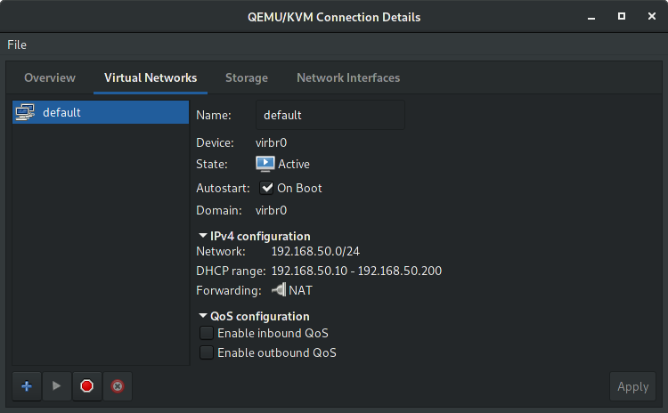

# ocp-arekkusu.io
A full detailed guide to install `Openshift (OKD)` into a single or more VMs using libvirt (openshift-ansible playbook)

This guide is mostly based on:

- [dnsmasq appendix](https://github.com/openshift/training/blob/master/deprecated/beta-4-setup.md#appendix---dnsmasq-setup) from the [openshift-training](https://github.com/openshift/training) repo. 
- [openshift ansible playbook](https://github.com/openshift/openshift-ansible).
- [gshipley installcentos scripts](https://github.com/gshipley/installcentos).
- [libvirt howto](https://github.com/openshift/installer/blob/master/docs/dev/libvirt-howto.md).
- [jlebon/dnsmasq.md gist](https://gist.github.com/jlebon/0cfcd3dcc7ac7de18a69).

However, I updated it for my needs and included fixes for the many gotchas I found along the way.

This is useful for folks who want to set up a DNS service as part of the cluster itself, either because they cannot
easily change their DNS setup outside of the cluster, or just because they want to keep the cluster setup self-contained.

**TL;DR**
- You can't modify external DNS
- You router sux
- You can't modify your router or anything but your libvirt host
- You want to expose your cloud inside a LAN not internet (over WiFi)
- You don't want to use minishift installation
- You have a 'bulky' laptop or Desktop PC for use as dedicated openshit cluster and want to work from another computer with development tools only

This is meant to be done *before* you run the `openshift-ansible` playbook, but it can be adjusted if you have already installed openshift using `openshift-ansible` playbook.
If you already have docker running, you will have to restart it after doing these steps.

Eventually, I hope to convert this to an ansible playbook. Thanks for your understanding.

---

```
~~~~~~~~~~~~~~~~~~~~~~~~~~~~~~~~~~~~~~~~~~~~~~~~~~~~~~
| Internet (ISP > Modem > Firewall > Wireless Router |
~~~~~~~~~~~~~~~~~~~~~~~~~~~~~~~~~~~~~~~~~~~~~~~~~~~~~~
  \
  |
  +------------------------+
  | M1:Fedora 29 works.    | bare-metal (alienware 18)
  | KVM/libvirt server     | 
  +------------------------+
  | wlp11s0: 192.168.0.10  | static-ip address (wireless interface)
  +------------------------+---------------------------+
  | virbr0: 192.168.50.1   | NAT (libvirt)             |
  |                        |          +--------------+ |
  |                        |          | VM1/CentOS 7 | | eth0: 192.168.50.10 (openshift)
  |                        |          +--------------+ | arekkusu.io
  |                        |          ...              |
  +------------------------+----------------------------
  \\                                               \\
  ||                                               ||
  // WiFi LAN                                      // WiFi LAN
  || Subnet Mask....: 255.255.255.0                ||
  \\ Default Gateway: 192.168.0.1                  +------------------------+     
  ||                                               | M3: Mobile Cellphone   | mobile device
  //                                               | iOS/Android (future)   | (web browser only)
  +------------------------+                       +------------------------+
  | M2:Fedora 28 works.    | bare-metal (laptop)
  | Developer Workstation  | 
  +------------------------+
  | wlp4s0: 192.168.0.17   | static-ip address (wireless interface)
  +------------------------+ (development tools only)

  
```

## 1. Setup the host machine (bare-metal)

### 1.1 Choose your host machine

For my current scenario, I'll be using my dear old Alienware 18.<br>
This machine is currently using the following hardware:
- Samsung EVO 850 SSD
- 32 GB RAM Kingston HyperX Impact DDR3 SO-DIMM 1600 MHz
- Intel(R) Core(TM) i7-4800MQ CPU @ 2.70GHz

### 1.2 Choose your linux distro

For the bare-metal 'bulky' laptop I have choosen to use Fedora 29.<br>You can install a server centered OS like CentOS or Red Hat Enterprise Linux (requires active subscription).

### 1.3 Install libvirt

After the OS installation steps, execute the following in the terminal:

```
$ sudo dnf install -y qemu-kvm libvirt virt-manager virt-install bridge-utils net-tools nmap
$ sudo gpasswd -a "${USER}" libvirt
$ sudo shutdown -r now
```

### 1.4 Configure host network

For this lab I have configure static-ip address for the server running libvirt.

Navigate through `/etc/sysconfig/network-scripts`<br>
Edit your wireless interface. It will be something like `ifcg-{SSID}`

To keep a static-ip address, you'll need to set this configuration like this:

`$ sudo vim /etc/sysconfig/network-scripts/ifcfg-<SSID>`

```
HWADDR=XX:xx:XX:xx:XX:xx
DEVICE=wlp11s0
ESSID=XXxxXXxxXX
MODE=Managed
KEY_MGMT=WPA-PSK
MAC_ADDRESS_RANDOMIZATION=default
TYPE=Wireless
PROXY_METHOD=none
BROWSER_ONLY=no
BOOTPROTO=static
DEFROUTE=yes
IPV4_FAILURE_FATAL=no
IPV6INIT=no
IPV6_AUTOCONF=yes
IPV6_DEFROUTE=yes
IPV6_FAILURE_FATAL=no
IPV6_ADDR_GEN_MODE=stable-privacy
NAME=NIGHTWING
UUID=9x99x9x-99x9-9x99x-xxxx-99xx99x9x9xxx9x9
ONBOOT=yes
IPADDR=192.168.0.10
NETMASK=255.255.255.0
PREFIX=24
GATEWAY=192.168.0.1
DNS1=192.168.0.1
DNS2=999.999.999.999
```

Then
`$ sudo systemctl restart NetWorkManager`<br>
If everything was setup correctly, you'll get connected with a static-ip address

## 2. Setup the openshift libvirt guest (VM)

Open `virt-manager` application, then check if you're currently have an virtual-network configured.<br>
If you don't, create a new one following the image below:



To keep this virtual-network active every boot, then:
`$ sudo virsh net-autostart default`


### 2.1 Choose your host machine


================================================================
================================================================
================================================================
================================================================
================================================================
================================================================
================================================================
================================================================
================================================================
================================================================
================================================================
================================================================
================================================================
================================================================

### A. Install dnsmasq

1. Choose and ssh into the node on which you want to install
dnsmasq. This node will be the one that all the other nodes
will contact for DNS resolution.  *Do not* install it on any
of the master nodes, since it will conflict with the
Kubernetes DNS service.

2. Install dnsmasq

    ```
    yum install -y dnsmasq
    ```

### B. Configure dnsmasq

1. Create the file `/etc/dnsmasq.d/openshift.conf` with the
following contents:

    ```
    strict-order
    domain-needed
    local=/example.com/
    bind-dynamic
    log-queries

    # If you want to map all *.cloudapps.example.com to one address (probably
    # something you do want if you're planning on exposing services to the
    # outside world using routes), then add the following line, replacing the
    # IP address with the IP of the node that will run the router. This
    # probably should not be one of your master nodes since they will most
    # likely be made unscheduleable (the default behaviour of the playbook).

    address=/.cloudapps.example.com/192.168.122.152

    # When you eventually create your router, make sure to use a selector
    # so that it is deployed on the node you chose, e.g. in my case:
    #   oadm router --create=true \
    #     --service-account=router \
    #     --credentials=/etc/origin/master/openshift-router.kubeconfig \
    #     --images='rcm-img-docker01.build.eng.bos.redhat.com:5001/openshift3/ose-${component}:${version}' \
    #     --selector=kubernetes.io/hostname=192.168.122.152
    ```

2. Add in the `/etc/hosts` file all the public IPs of the nodes and
their hostnames, e.g.


    ```
    192.168.122.26 ose3-master.example.com ose3-master
    192.168.122.90 ose3-node1.example.com ose3-node1
    192.168.122.152 ose3-node2.example.com ose3-node2
    ```

3. Copy the original `/etc/resolv.conf` to `/etc/resolv.conf.upstream`
and in `/etc/dnsmasq.conf`, set `resolve-file` to
`/etc/resolv.conf.upstream`.

### C. Configure `resolv.conf`

1. On *all the nodes*, make sure that `/etc/resolv.conf` has the IP of
the node running dnsmasq only. **Important:** on the node running
dnsmasq, do not use 127.0.0.1, use the actual cluster IP, just like the
other nodes. This is because docker by default
[ignores](http://docs.docker.com/engine/userguide/networking/default_network/configure-dns/)
local addresses
when copying `/etc/resolv.conf` into containers. Here's a sample
`/etc/resolv.conf`:

    ```
    search example.com
    # change this IP to the IP of the node running dnsmasq
    nameserver 192.168.122.90
    ```

2. Make sure that in `/etc/sysconfig/network-scripts/ifcfg-eth0`, the
variable `PEERDNS` is set to `no` so that `/etc/resolv.conf` doesn't get
overwritten on each reboot. Reboot the machines and check that
`/etc/resolv.conf` hasn't been overwritten.

### D. Open DNS port and enable dnsmasq

1. Finally, make sure port 53/udp is open on the dnsmasq node. We have
to use iptables rules for this, even if you have `firewalld` installed.
Otherwise, the `openshift-ansible` playbook will disable and mask it and
we will lose those rules. If you do have `firewalld`, let's mask it and
replace it with `iptables-services`:

    ```
    # systemctl stop firewalld
    # systemctl disable firewalld
    # systemctl mask firewalld
    # yum install -y iptables-services
    # systemctl enable iptables
    # systemctl start iptables
    ```

2. Install the DNS iptables rules

    ```
    # iptables -I INPUT 1 -p TCP --dport 53 -j ACCEPT
    # iptables -I INPUT 1 -p UDP --dport 53 -j ACCEPT
    # iptables-save > /etc/sysconfig/iptables
    ```

3. Restart the `iptables` service and make sure that the rules are still
there afterwards.

4. Enable and start dnsmasq:

    ```
    # systemctl enable dnsmasq
    # systemctl start dnsmasq
    ```

### E. Check that everything is working

1. To verify that everything is good, run the following on each node,
and check that the answered IP is correct (`dig` is in the `bind-utils`
package if you need to install it):

    ```
    # Check that nodes can look each other up (replace names as needed)
    [root@ose3-node1]# dig ose3-node2.example.com
    # Check that nodes can look up the wildcard domain. This should
    # return the address of the node that will run your router.
    [root@ose3-node1]# dig foo.cloudapps.example.com
    ```
